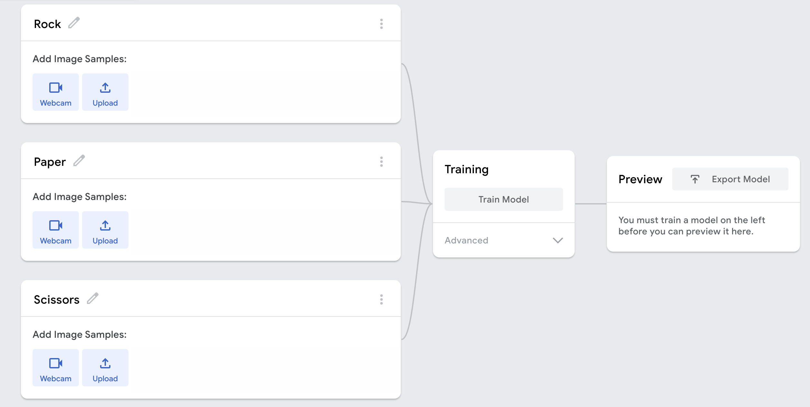
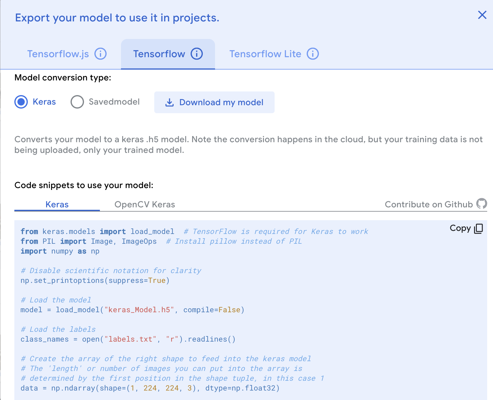
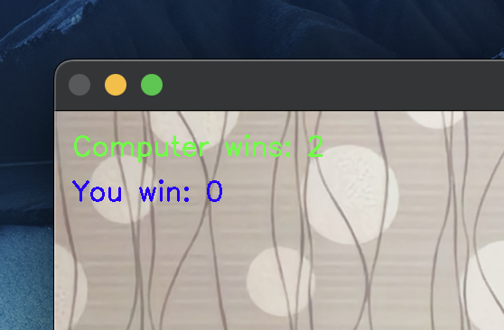

# Computer Vision game: Rock-Paper-Scissors (RPS) 
Rock-Paper-Scissors is a game in which each player simultaneously shows one of three hand signals representing rock, paper, or scissors. Rock beats scissors. Scissors beats paper. Paper beats rock.

The player who shows the first option that beats the other player's option wins.

This is an implementation of an interactive Rock-Paper-Scissors game, in which the user can play with the computer using the camera.

## Construct the game using keyboard input
This mission requires a training module to capture the user's gesture, which will be separately dicussed in the next section. Here, we need to make a simple test to make sure the logic of RPS winner works.

In the 'manual_rps.py', the RPS game is running with keyboard input. The game follows the rule:
    win_rule = {
        'Rock':'Scissors',
        'Scissors':'Paper',
        'Paper':'rock'
    } (where the pair of key-value pair shows the rule of the game).

## Computer vision model
This section is to create a computer vision model which detects the gesture from users. 'Teachable Machine' (https://teachablemachine.withgoogle.com/) offers a fast and easy way to create such machine learning models. 

Inside the online traning web, we will input a group of gestures captured from the camera. (Note that the mirror of the camera for some laptops may affect the recognition accuracy, thus, try to modify the angle of gestures will help).

Download the model from the "Tensorflow" tab in Teachable-Machine. The model should be named keras_model.h5 and the text file containing the labels should be named labels.txt.

The files you are downloading contain the structure and the parameters of a deep learning model. They are not files that can be run, and they do not contain anything readable if look inside. Later, we will load them into Python application.

## RPS game powered by computer vision
Now, to assemble the game with machine learning model, we need to use the downloaded 'keras_model.h5' file.

Replace the hard-coded user guess with the output of the computer vision model. Create a new file called camera_rps.py where you will write the new code.

Create a new function called get_prediction that will return the output of the model used earlier.

Remember that the output of the model you downloaded is a list of probabilities for each class. You need to pick the class with the highest probability. So, for example, assuming you trained the model in this order: "Rock", "Paper", "Scissors", and "Nothing", if the first element of the list is 0.8, the second element is 0.1, the third element is 0.05, and the fourth element is 0.05, then, the model predicts that you showed "Rock" to the camera with a confidence of 0.8.

The model can make many predictions at once if given many images. In your case you only give it one image at a time. That means that the first element in the list returned from the model is a list of probabilities for the four different classes. Print the response of the model if you are unclear of this.

### 'Camera_rps.py': inside the while loop which opens the camera
- I add a condition to decide which timing to select the gesture from the user (every 3 seconds)
- Inside the condition, we can call the function to ask computer to randomly make a selection and compare the user's gesture recoginized by the learning model
- In terms of the returns, considering the final demands that we need to end the game following the 'reach 3 wins' condition, the info of who wins should be recorded.

### Comments:
- The Teach machine model is roughly ideal. I have insert training shots around 500 pictures. When consider to improve the recognition rate, modification of the hand distance to the camera, angles, etc., will help.

### Packages:
See 'requirements.txt'